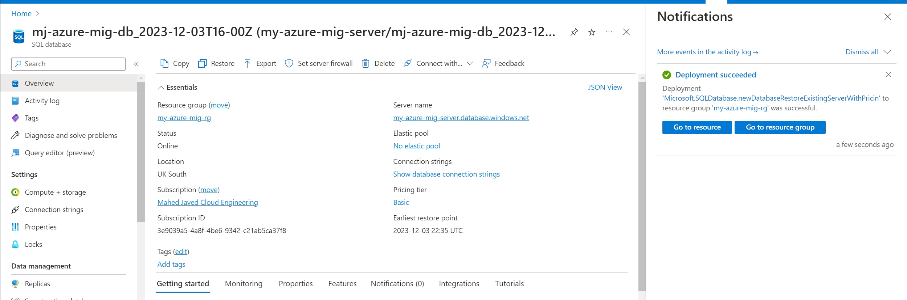

# Azure DataBase Migration
  

  ## Project Background 📝

Shifting data from one source to another (A to B) is an example of a data migration process. There are many reasons why an industry may want to accomplish this: upgrading an old legacy system (a collection of dashboards/reports pulling from multiple sources), safety concerns etc. Though it may sound as trivial as a simple 'lift and shift' problem, in reality it is a more complex procedure surpassing simplistic approaches as a simple 'copy and paste'.

A common migration process involves shifting data from on-premise to a cloud service. Several cloud providers offer superior data handling stratergies alongside security and access control. These services provide a much more attractive solution to companies then to developing on-hand softwares and tools which can be heavily involved and may waste companies resources and time since alot of it will be 'reinventing the wheel'
 
The following project simulates a typical migration scenerio. It mimics migration to Azure Cloud services. The project is broken into 8 milestones. Each covering topics such as Azure Virtual Machine, Azure Entra ID for access control, Geo-replication and failover testing for backup security and Microsoft Entra ID for user access control. The entire architecture of the cloud model developed in this project is shown below.

## Cloud Architecture

  ## Table of Contents 🗒

  * [Milestones](#milestones-💻)

    * [Milestone 1](#milestone-1)
    * [Milestone 2](#milestone-2)
    * [Milestone 3](#milestone-3)
    * [Milestone 4](#milestone-4)
    * [Milestone 5](#milestone-5)
    * [Milestone 6](#milestone-6)

  * [License](#license-📛)
  
  * [Contributors](#contributors-😃)

  * [Questions](#questions)
  ## Milestones  💻

 ### Milestone 1
 
This milestone mainly focused on the installation, setup and testing of the production environment in the form of an Azure Virtual Machines. The purpose is to setup an environment that will allow carrying out of the migration tasks in a safe and workable configurations without comprimising on-premise database and security. The key steps taken for this are highlighted as shown below:

  * **Setup Azure Virtual Machine** : a seperate virtual machine was setup as the testing production environment labelled `my-azure-mig-rg`. A windows 11 image was used with size `Standard DS2 v3` with 2 CPU cores and 120 GB hard disk space. For region `UK (South)` was picked and Geo-Replication was enabled. It was ensured that for security purposes a SQL authentication method is used and to prevent unecessary connections to the VM, the `Remote Desktop Protocol(RDP)` was enabled for remote access and inbond network traffic managed by the `network security group (NSG)` firewall on `port 3389`.

  

   * **Setup Microsoft SQL Server Management System (SSMS) and SQL Server** : the SQL Server focuses on the core database engine and functionality, while SSMS environment provides a user-friendly interface, visual tools, and scripting capabilities for database management and administration. For the purpose of enabling periodic backups using `SQL Server Agent` (see [Mileston 4](#mileston-4)), the `Developer` version of SQL Server version 2022 was installed. (link : https://www.microsoft.com/en-us/sql-server/sql-server-downloads). For the purpose of the experiments, the sample database `AdventureWorks ver. 2022` was used. This can be obtained from (https://learn.microsoft.com/en-us/sql/samples/adventureworks-install-configure?view=sql-server-ver16&tabs=ssms) where the `.bak` file can be restored in SSMS.

---

 ### Milestone 2
 
In this milestone, the on-premie local DB (`AdventureWorks`) is migrated to the database in the Azure's cloud system via the Azure SQL Database services. This milestone is broken down into the following steps: a) setting up of Azure SQL Database, b) ensuring connection between the local DB and the cloud data in the Azure SQL database, c) comparing schemas of local and cloud DB and d) migrating

* **Create an Azure SQL Database** : an Azure SQL Database of the `Basic` pricing tier with `5 DTUs` (mixture of CPU, memory, read and write operations), a storage size of `2GB`, with `Pulic Access` enabled and a firewall rule setup to allow direct connection from Azure Data Studio. For security and backup, a differential backup frequence of `24hrs` was enabled with `Point-in-time recovery (PITR)` retenetion of 7 days and `geo-redundant` backup storage was set.

* **Connection Local DB with Cloud in Azure Data Studio** : initially, the local DB was uploaded in Azure Data Studio services. Azure Data Studio tools allows seamless transition of data with powerful and user-friendly database management tools. To enable connection to the cloud DB, an addittional `firewall rule` was added to the networking setting of the Azure SQL database. Here, the IP address of the virtual VM was registered for both `StartIP` and `EndIP` options. Once confirmed, the experiment would progress to comparison of the schemas for the two databases.

* **Schema Comparison** : the comparison and synchronisation of database schemas was carried out using the `SQL Server Schema Compare` extension in Azure Data Studio. This extension simplifies the comparion of database schemas for seamless database migration.

* **Migration** : initially the Azure Data Studio services was installed. Connnections to both the local DB and the Azure SQL database were enabled. The migration process was accomplished using the `Azure SQL Migration extension`. As shown in the figure below, the tables are successfully migrated from the local DB to the Azure SQL Databse.

The purpose of adopting the use the extension for the migration process is that it simplifies and streamlines the entire process. The major underlying processes are automated by the extension. One does not have to reinvent the wheel. Some of the key tasks the extension automates are :

  * Ensuring a reliable connection between the local DB and the Azure SQL database
  * Provide integration capabilities across seperate networks (under the hood the extension makes use of Microsoft Integration Runtime:  https://microsoft.com/en-gb/download/details.aspx?id=39717)
  * A validation procedure to ensure the migration settings are correct and error-free and to identify issues that may arise whilst the process.

  ---

 ### Milestone 3

Once the migration is accomplished, this milestone aims to seperately store the production database on Azure. For that, a seperate VM is setup that will act as the production environment. It is common in enterprises to have the main database (storing client information for example) while the development environment conserved for testing purposes. 

Addittionaly, an automatic backup solution for the the development environment is also setup. This serves as a great testing ground in the development environment. It ensures any incorrect modification of the data during experimenting is easily reverted via quick recovery.

So, breifly, two seperated backup methods are explored. These aim at ensuring that the on-premise data on the production environment is kept reserved in case of accidental loss. One method aims to save the backup on cloud using Azure Blob storage. The second to store a local copy on the VM using automatic backup solution in SSMS. Automatic backup solutions provided in SSMS are of type `full` (backup of entire database), `differential` (backup of entire database since previous `full` checkpoint) and `transaction log` (backup at specified point in a backup chain). This experiment uses the full configuraiton.

* **Cloud Backup of On-Premise Data** : The backup of the local DB was created using `Azure Blob Storage` services. These offer highly scalable and durable cloud storage for unstructured data with flexible storage tiers balancing performance and cost requirements. For the purpose of this experiment, the `General Purpose V2` storage was selected with `Geo-Redundant` storage enabled for the replication. For the Azure Storage container security, the `public access level` was set. This option allowed read access to both the contents of the container and the list of blobs. 

* **Local Backup of On-Premise Data** : The local DB hosted on the production environment was also backuped locally using full backup confiugration in SSMS.

This was followed by setting up of periodic backups for the local DB in SSMS and have these uploaded in Azure Blob storage created in the previous task. The primary reasons for using Azure Blob for backup include durability against hardware failures, accessible across anywhere as long as user is connected to the internet, scalability and geo-redundancy.

The process of connecting to Azure Blob storage to SQL Server was done by setting up the `SQL Server Agent`, a component of SSMS that deals with scheduling and alerting of tasks (including backup). This was then followed by setting up of the credentials in the form of two accesss keys to connect to the blob storage. Once connected, the SSMS `Maintenance Plan Wizard` was used to setup a weekly backup schedule. Here the backedup .bak files would be synced with the blob storage to ensure a cloud copy is updated, this allowed a streamline connection between the on-premise and the cloud-based backup.

---

### Milestone 4

With the success of backing up on-promise database, this milestone set out to mimic a typical scenerio of data loss in the production environment to test the robustness of the backup system. 

* **Data Loss Simulation** : Based on the EDA of the AdventureWorks ver 2022, it was confirmed that the most vital information rests in the sales information, the most sensitive information in the credits table as well as the table of individual addresses. If exposed, corrupted or deleted, these could prove fatal. Hence, a mixture of data deletion and corruption simulation was adopted. Firstly, the data deletion within the `Person` table (total 20072 entries) was carried out as shown below in the SQL commands ensuring both deletion as well as corruption of the address columns.

As a result the total number of columns dropped to 19972. Then, the next sensitive information rests within the sales database. This was carried out as follows.

Following the deletion of information the affected database lost vital information on the stores (total 701). Resulting in dropping of the columns from 701 to 601 as shown below.

* **Restoration** : Once the vital data loss process simluated, the experiment followed the restoration of the database based on the Azure Blob cloud storage. This was carried out by first navigating to the appopriate backup storage and executing the restore command. This was folowed by setting up the appropriate time for the recovery to take initiate from. In our experiment, the data loss was triggered on approx `03-12-23 23:45`, hence the restore point was set an hour back and finally the seperate version of the restored database was created and stored as shown.

For an example to see if the recovery was successful using the `Store` table sample it was observed the number of columns were reverted back to 701 as shown below.

---

### Milestone 5

Having setup the on-cloud backup database servers and being able to safe guard against data loss and corruption, we can be more confident on the security of our database. Though these can cover disaster recovery on a local scale within a region (e.g UK South), for scenerios where a disaster affects an entire region (e.g. power outtage) it is then necessary to have a seperate backup in a different geographical location such that during these events, a swift switch to the geographical database can in the long run minimize downtime. This is known as `failover` in geo-replication and is accomplished in this milesone. It is broken into two steps: setting the geographical backup and secondly testing the failover scenerio.

* **Geo-Replication Server Setup** : First and foremost, a seperate server was setup that will act as a primary database once failover testing is performed. The geo-replication was perfomed by first adding a `replicas` in the Database Management section of the on-cloud backup Azure SQL Database as shown. 

A key reminder from other milestones is that the `mj-azure-mig-db` is the main production DB whereas the `mj-azure-mig-db_2023-12-03T16-00Z` is the restored version. The geo-replicas exist in the restored version of the Azure SQL database, the regio for which is set to US for this experiment.

* **Failover Setup** : in order to initiate the failover, the server in the primary region (UK) was linked with the geo-replicated US server. The failover was setup as shown. 

Initialy, the UK server is set as the primary server and the US as the secondary. Once failover initiated, the roles are swaped as shown.

---

### Milestone 6

The migration is completed, it is time that business presents the front-end PowerBI reports based on the data to the business. Some staff require further access to Azure based resources or be able to read the database and give their own insights. It then becomes imperative for the cloud engineer to manage the security of user identities and their access to the relevant resources on the cloud. As part of security and access management, the `Microsoft Entra ID` access provides user authentication, authorization and access management. This milestone aims at integrating Microsoft Entra Directory with the Azure SQL Database. Firstly, it begins by developing first an admin account that oversees the entire production database. and restricting users to `read-only` access to the database. Secondly, it will also set up a seperate database reader account, allowing users to read but not modify data. This is crucial in a production setting where accuracy is key. Restricted access prevents accidental changes, ensuring the team gets needed insights safely.

* **Configure Microsoft Entra ID for Azure SQL Database** : first, the Microsoft Entra ID authentication was setup for the SQL Server hosting the Azure SQL production database. A seperate account with admin priveleges was setup. The following was confirmed by connecting the production database using Microsoft Entra credentials in Azure Data Studio. The sample of the accomplished task is shown below.

* **Setting Up The Read-Only Database and Connecting to Azure Data Studio** : to commence the process, a new user account was generated in Microsoft Entra ID, serving as the DB Reader user. In Azure Data Studio, the connection to the production database was established using the Microsoft Entra admin credentials. Following this, the db_datareader role was assigned to the previously generated DB Reader User, granting them read-only privileges. Subsequently, there was a reconnection to the production database using Azure Data Studio and the credentials of the new DB Reader AD user. A test of the user's permissions was conducted to verify that the correct role had been assigned. This is shown below.

## License 📛 

Copyright @ MIT. All rights reserved.

Licensed under the MIT license.

## Contributors 

Mahed Javed - ksfmahed@outlook.com

## Questions

For additional questions, contact me at the email provided below. 

- GitHub: [mahedjaved](https://github.com/mahedjaved/)
- Email:  mahed95@gmail.com
